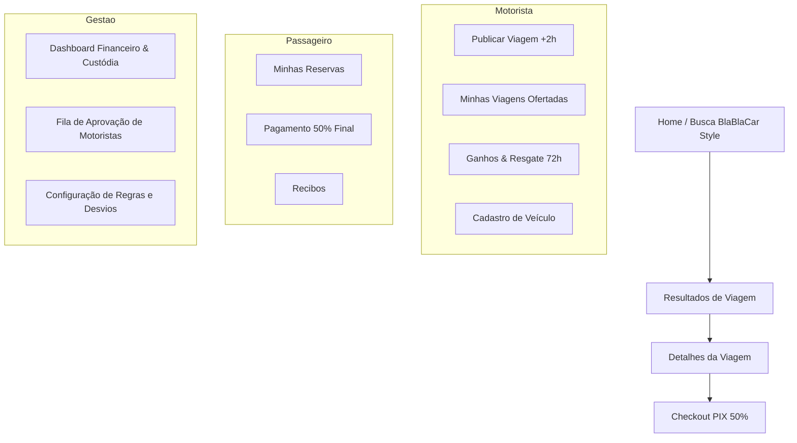

# MOC - Frontend & Arquitetura de Interface

Visão arquitetural do front-end da plataforma, estruturado em padrões modulares modernos, responsivos e acessíveis, alinhado à experiência do usuário do BlaBlaCar.

---

## Arquitetura Técnica Recomendada

- **Framework**: React / Next.js (ou Vite SPA com roteamento modular).
- **Estilização**: Tailwind CSS com tokens customizados definidos em [[Design_System_BlaBlaCar]].
- **Gerenciamento de Estado**: Zustand / TanStack Query (para cache e sincronização de dados assíncronos de rotas e pagamentos).
- **Mapas & Rotas**: Mapbox GL ou Google Maps SDK para exibição visual do trajeto e cálculo de compatibilidade ([[Busca_Compatibilidade_Rotas]]).
- **Tempo Real**: WebSocket / Supabase Realtime para notificações e mensageria instantânea ([[Mensageria_Notificacoes]]).

---

## Mapa de Telas por Perfil

---

## Sprints de Implementação do Front-end

1. [[Sprint_01_DesignSystem_Fundacao]]: Setup do projeto, Tailwind theme, tokens e biblioteca de componentes BlaBlaCar.
2. [[Sprint_02_Autenticacao_Perfis]]: Telas de cadastro, solicitação de motorista, validação de e-mail e gestão de perfil/veículo.
3. [[Sprint_03_Busca_Listagem]]: Barra flutuante de busca, cards com timeline e filtros de horário/preço/comodidades.
4. [[Sprint_04_Publicacao_Viagem]]: Formulário de publicação de rotas, validação de antecedência de 2 horas e favoritos.
5. [[Sprint_05_Reserva_Checkout_PIX]]: Fluxo de reserva, modal de pagamento PIX (50%), cancelamentos e estornos.
6. [[Sprint_06_Mensageria_Notificacoes]]: Central de mensagens em tempo real vinculada à corrida e notificações push.
7. [[Sprint_07_Avaliacoes_Cooperativa]]: Avaliação bidirecional, badge de cooperado e planos de assinatura.
8. [[Sprint_08_Dashboard_Gestao]]: Painel administrativo com KPIs de custódia, aprovação de motoristas e relatórios.

---

## Links Relacionados
- [[Design_System_BlaBlaCar]]: Diretrizes visuais completas.
- [[Sprint_Overview]]: Cronograma geral de entregas.
- [[MOC_Regras_Negocio]]: Validações de formulários e regras.
- [[MOC_Geral]]: Retorno ao índice geral.
