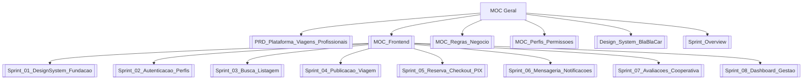

# MOC - Mapa Central do Segundo Cérebro

Hub de navegação da **Plataforma de Viagens Compartilhadas para Profissionais (Cooperativa)**.

---

## Estrutura de Navegação

---

## Núcleos do Conhecimento

### 1. Planejamento & Execução (Frontend)
- [[MOC_Frontend]]: Arquitetura do front-end, stack técnica, componentes e roteamento.
- [[Design_System_BlaBlaCar]]: Guia visual inspirado no BlaBlaCar (cores, tipografia, cards, busca e timeline).
- [[Sprint_Overview]]: Visão consolidada das 8 sprints de entrega.

### 2. Regras de Negócio e Operação
- [[MOC_Regras_Negocio]]: Catálogo com as 26 Regras de Negócio (RN-01 a RN-26) e máquinas de estado.
- [[Cancelamento_Estorno_Repasse]]: Custódia, cancelamentos (mais/menos de 1h), estornos e resgates (72h).
- [[Reserva_Checkout_PIX]]: Fluxo de pagamento 50% na reserva + 50% no encerramento.
- [[Cooperativa_Assinaturas_Beneficios]]: Badges de cooperado, planos de assinatura e desconto por volume de corridas.

### 3. Perfis e Atores
- [[MOC_Perfis_Permissoes]]: Matriz RBAC para Administrador, Motorista, Passageiro e Gestor.
- [[Cadastro_Autenticacao]]: Fluxo de solicitação com validação de e-mail, aprovação admin e senha provisória.

### 4. Funcionalidades Detalhadas
- [[Busca_Compatibilidade_Rotas]]: Algoritmo de rotas reais e exclusão de desvios incompatíveis.
- [[Publicacao_Viagem]]: Cadastro de rota, bloqueio de 2h de antecedência e características do veículo.
- [[Mensageria_Notificacoes]]: Chat em tempo real por corrida e eventos push/in-app.
- [[Avaliacoes_Reputacao]]: Avaliação bidirecional motorista/passageiro e cálculo de médias.
- [[Dashboard_Admin_Gestor]]: Métricas de volume transacionado, custódia e indicadores operacionais.

---

## Documentos de Origem
- [[PRD_Plataforma_Viagens_Profissionais]]: Documento de Requisitos de Produto consolidado.
