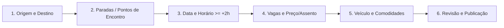

# Funcionalidade: Publicação e Edição de Viagens

Permite ao motorista cadastrar rotas, vagas, preços e comodidades com validação temporal restrita.

---

## Regras de Negócio e Requisitos

- **RN-06**: A publicação só é permitida para horários iguais ou superiores a **2 horas após o horário atual** (validação no client e no server).
- **RN-07**: Exige preenchimento de origem, destino, data e horário de partida.
- **RN-08**: Limite de passageiros atrelado à capacidade máxima do veículo cadastrado.
- **Favoritos**: Possibilidade de salvar pontos de partida/chegada recorrentes para autopreenchimento rápido.
- **Edição & Notificação**: Alterações em viagens já reservadas notificam passageiros e disparam política de confirmação.

---

## Fluxo Visual BlaBlaCar (Step-by-Step)

---

## Componentes de Interface

- `RouteInput`: Autocomplete de endereços com geocodificação.
- `TimePickerRestricted`: Seletor de data/hora que desabilita horários anteriores a $T + 2h$.
- `SeatCounter`: Contador incremental de assentos com limite por veículo.
- `PriceSuggester`: Sugestão de faixa de preço média recomendada.
- `FavoritePointsPicker`: Atalho para origens/destinos favoritados.

---

## Links Relacionados
- [[Design_System_BlaBlaCar]]: Padrões visuais dos inputs e stepper.
- [[MOC_Regras_Negocio]]: Regras RN-06, RN-07 e RN-08.
- [[Sprint_04_Publicacao_Viagem]]: Sprint de implementação do fluxo.
- [[MOC_Geral]]: Retorno ao índice geral.
