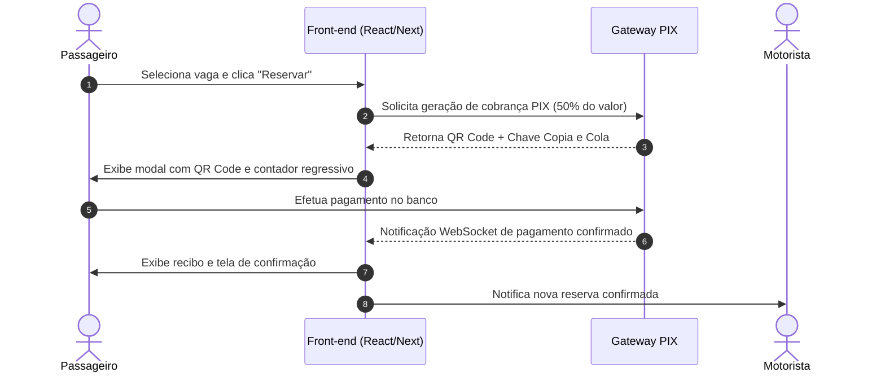

# Funcionalidade: Reserva e Checkout PIX

Fluxo de reserva de assento com retenção de sinal e pagamento dividido.

---

## Regras de Pagamento

- **RN-11**: O passageiro paga **50% do valor no momento da reserva** como garantia de vaga.
- **RN-12**: O saldo restante de **50% é pago no encerramento da corrida** via PIX.
- **RN-13**: Todos os pagamentos trafegam pela plataforma em conta de custódia.
- **RN-26**: Emissão instantânea de recibo digital contendo ID da transação, partes envolvidas, horário e valor.

---

## Fluxo de Checkout (Interface)

---

## Componentes de Interface

- `BookingDrawer`: Gaveta lateral de confirmação com resumo da rota e detalhamento de valores.
- `PixModal`: Renderizador de QR Code dinâmico com botão de cópia de código em 1 clique e temporizador de 10 minutos.
- `PaymentStatusTracker`: Indicador animado de confirmação de pagamento.
- `ReceiptViewer`: Modal e exportador PDF do comprovante oficial da plataforma.

---

## Links Relacionados
- [[Cancelamento_Estorno_Repasse]]: Regras de estorno e repasse aos motoristas.
- [[Design_System_BlaBlaCar]]: Padrões visuais do modal e recibo.
- [[Sprint_05_Reserva_Checkout_PIX]]: Tarefas de implementação.
- [[MOC_Geral]]: Retorno ao índice geral.
