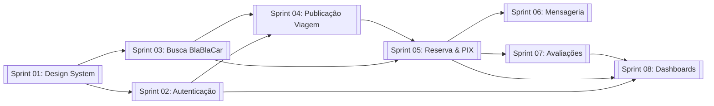

# Roadmap e Visão Geral das Sprints do Front-end

Cronograma estruturado para desenvolvimento completo do front-end da plataforma de viagens profissionais, com identidade visual inspirada no BlaBlaCar.

---

## Tabela Resumo das Sprints

| Sprint | Foco Principal | Principais Entregas | Documento de Detalhe |
| :---: | :--- | :--- | :--- |
| **01** | Fundação & Design System | Setup, Tailwind theme BlaBlaCar, UI Kit, layouts e roteamento | [[Sprint_01_DesignSystem_Fundacao]] |
| **02** | Autenticação & Perfis | Login, solicitação de motorista, validação de e-mail e gestão de veículos | [[Sprint_02_Autenticacao_Perfis]] |
| **03** | Busca & Listagem BlaBlaCar | Barra flutuante de busca, cards com timeline e filtros avançados | [[Sprint_03_Busca_Listagem]] |
| **04** | Publicação de Viagens | Wizard de criação de viagens, trava de 2h e pontos favoritos | [[Sprint_04_Publicacao_Viagem]] |
| **05** | Reserva & Checkout PIX | Fluxo de reserva 50% inicial, modal PIX, cancelamentos e recibos | [[Sprint_05_Reserva_Checkout_PIX]] |
| **06** | Mensageria & Notificações | Chat em tempo real vinculado à corrida e central de notificações | [[Sprint_06_Mensageria_Notificacoes]] |
| **07** | Avaliações & Cooperativa | Avaliação bidirecional, badge de cooperado e planos de mensalidade | [[Sprint_07_Avaliacoes_Cooperativa]] |
| **08** | Dashboard & Gestão | Painel financeiro de custódia, fila de aprovação e configurações | [[Sprint_08_Dashboard_Gestao]] |

---

## Dependências e Sequenciamento

---

## Links Relacionados
- [[MOC_Frontend]]: Arquitetura do front-end.
- [[Design_System_BlaBlaCar]]: Biblioteca visual.
- [[MOC_Geral]]: Retorno ao índice geral.
